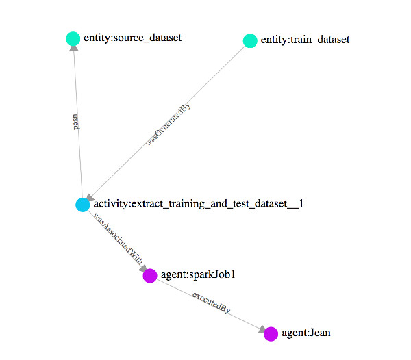

SPURISTO (Tracker in Esperanto)
==================================

[](https://travis-ci.org/dmartinpro/spuristo)

Inspired by
-----------

This project is inspired by [Komadu project](https://github.com/Data-to-Insight-Center/komadu)


Tracking what?
--------------

Who, When and how data was created, with as many context information as needed.
And this is currently the kind of (simple for now) visualization Spuristo can provide: 




How to run the project
----------------------

Start two Docker containers: RabbitMQ and ArangoDB

```
docker run -d --hostname localhost --name rabbit -p 8880:15672 -p 5672:5672 -p 5671:5671 -p 4369:4369 -p 25672:25672 -e RABBITMQ_DEFAULT_USER=admin -e RABBITMQ_DEFAULT_PASS=admin rabbitmq:3-management
```

```
docker run -e ARANGO_ROOT_PASSWORD=root -p 8529:8529 -d -v /Users/dmartin/arangodata:/var/lib/arangodb3 arangodb
```

Then start the (Spring Boot) application:

```
mvn spring-boot:run
```

You are ready to go.

You can publish data in RabbitMQ queues and look at the relations between entities with this URL:

```
http://localhost:6789/path?key=YourEntityKeyHere
```

What data can be?
-----------------

3 types of data for now:

* Entity
* Activity
* Agent

They all extend in a way or another a common type, called Thing (for now, not found something more clear to describe this ... thing :) ). 

And one 'edge':

* Relation


JSON format of these "Things"
-----------------------------

An Entity:

```
  {
    "entity": {
      "key": "entity1",
      "clazz": "entity",
      "attributes": [
        {
          "name": "role",
          "value": {
            "abc": "ABC",
            "def": "DEF",
            "ghi": "GHI",
            "klm": "KLM"
          }
        },
        {
          "name": "label",
          "value": {
            "_default": "attribute1"
          }
        },
        {
          "name": "location",
          "value": {
            "_default": "attribute2"
          }
        },
        {
          "name": "value",
          "value": {
            "_default": "attribute3"
          }
        }
      ]
    }
  }
```


An Agent:

```
  {
    "agent": {
      "key": "agent1",
      "clazz": "agent",
      "attributes": [
        {
          "name": "role",
          "value": {
            "abc": "ABC",
            "def": "DEF",
            "ghi": "GHI",
            "klm": "KLM"
          }
        },
        {
          "name": "label",
          "value": {
            "_default": "attribute1"
          }
        },
        {
          "name": "other",
          "value": {
            "_default": "attribute2"
          }
        }
      ]
    }
  }
```

An Activity:

```
  {
    "activity": {
      "key": "activity1",
      "clazz": "activity",
      "attributes": [
        {
          "name": "role",
          "value": {
            "abc": "ABC",
            "def": "DEF",
            "ghi": "GHI",
            "klm": "KLM"
          }
        },
        {
          "name": "label",
          "value": {
            "_default": "attribute1"
          }
        },
        {
          "name": "other",
          "value": {
            "_default": "attribute2"
          }
        }
      ]
    }
  }
```

They are just the same, except a property (clazz, which is set automatically when the Java object is created since it's based on the class used).


A Relation:

```
  {
    "relation": {
      "key": null,
      "clazz": "relation",
      "attributes": null,
      "from": {
        "entity": {
          "key": "entity1",
          "clazz": "entity",
          "attributes": [
            {
              "name": "role",
              "value": {
                "abc": "ABC",
                "def": "DEF",
                "ghi": "GHI",
                "klm": "KLM"
              }
            },
            {
              "name": "label",
              "value": {
                "_default": "attribute1"
              }
            },
            {
              "name": "location",
              "value": {
                "_default": "attribute2"
              }
            },
            {
              "name": "value",
              "value": {
                "_default": "attribute3"
              }
            }
          ]
        }
      },
      "to": {
        "agent": {
          "key": "agent1",
          "clazz": "agent",
          "attributes": [
            {
              "name": "role",
              "value": {
                "abc": "ABC",
                "def": "DEF",
                "ghi": "GHI",
                "klm": "KLM"
              }
            },
            {
              "name": "label",
              "value": {
                "_default": "attribute1"
              }
            },
            {
              "name": "other",
              "value": {
                "_default": "attribute2"
              }
            }
          ]
        }
      },
      "type": "wasGeneratedBy"
    }
  }
```

A Relation contains full Thing objects in its "from" and "to" properties. You can create all 3 objects (Relation, From Thing and To Thing) when sending only the Relation. I'm sure it's not efficient the way it is currently coded, but as it's not my top priority right now, it doesn't matter, especially if transparently told ;-)
A relation can also have its own set of attributes, why not after all?

For all the objects, the "key" MUST be unique in the category of each object (Two entities CAN'T have the same 'thing1' key, but an Activity and an Agent CAN have a key equals to "thing1").


What's useful for a data lineage service [WIP right under]
----------------------------------------

Some use cases:

Describe a model training
* identify the data sets used
  * main data set and derived data sets (training, test...)
  At least a macro description : id of the data set (file path, other ?) and a description
  At most, the exact set described as a collection of entities
  
* identify the set of parameters used
  An entity describing the set, with the use of parameters could be enough

* identify the algorithm used
  should be an attribute of the model ?

* identify the actions (data cleansing, fixing...), the intermediates entities and when the actions occur
  Can this be described as a plan?

* identify the agent running the action
* identify the output (model version)

Describe a prediction, on behalf of a user, based on a specific version of a model and a set of data
* identify the action and the time of the action
* identity who is the user and the role he is playing in the action
* identify the model version used and the generic model it is linked to
* identify the data provided in order to have a prediction
* identify the result


Expected methods:

* being able to create an entity with the minimum set of optional attributes
* being able to add relations between entities (derived, revision)

* being able to create an activity with the minimum set of optional attributes
* being able to add relations between activities (derived, revision)

* being able to create an agent with the minimum set of optional attributes
* being able to add relations between entities (derived, revision)
